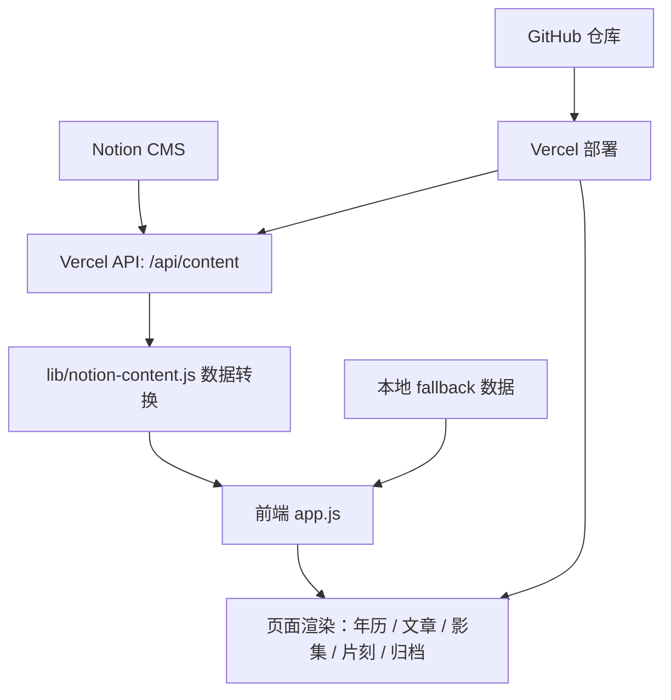

# personalitem

## 开发过程

网站从 2026/07/02 开始搭建，并在 2026/07/25 完成 GitHub 与 Vercel 部署。

### 阶段 1：确定网站方向和页面结构

最初目标是做一个个人博客，但很快从“博客”扩展为一个个人记录系统。页面结构逐渐确定为：

- 首页 / 年历；
- 文章；
- 影集；
- 片刻；
- 关于；
- 归档。

后来首页被明确为 Calendar，也就是产品入口直接进入年历页面。站名 22:27 点击后进入年历。

### 阶段 2：完成基础页面

早期页面包括关于页、年历、文章列表、影集、片刻和归档。  
内容一开始主要写在本地 JavaScript 文件中：

- `app.js`：文章、影集、年历、归档和主要交互；
- `moments-data.js`：片刻数据；
- `about-questions.js`：快问快答数据。

### 阶段 3：反复调整视觉系统

项目经历了多轮颜色、字体、布局和细节调整：

- 建立日间 / 夜间主题变量；
- 多次尝试日间 Accent Color；
- 统一字体、字号、边距和细线；
- 调整顶部导航；
- 优化双栏比例；
- 删除多余导航入口；
- 恢复和简化部分页面结构；
- 统一影集、片刻、归档里的年月样式。

### 阶段 4：完善交互与动效

随后加入了大量细节交互：

- 自定义圆环光标；
- hover 状态；
- 日夜模式切换；
- 年历节日 Emoji 动画；
- 影集卡片 hover 和留言弹窗；
- 片刻图片灯箱；
- 搜索空状态；
- 标签展开；
- 文章已阅状态；
- 节日完成 / 未完成状态。

其中年历、影集和片刻经过了最多次细调。

### 阶段 5：内容结构稳定与 Notion CMS 设计

当网站界面基本完成后，开始从“本地写死数据”转向 CMS。  
创建了 Notion CMS 页面和数据库：

- Articles；
- Moments；
- Media；
- Tags；
- QuickQA；
- SiteConfig；
- CalendarNotes；
- SiteLogs。

随后增加 Vercel API：

- `api/content.js`
- `lib/notion-content.js`

实现浏览器刷新时由 Vercel 后台读取 Notion 内容，避免把 Notion Token 暴露在前端。

### 阶段 6：GitHub 与 Vercel 上线

2026/07/25，项目上传到 GitHub 仓库 `scopego/personalitem`，并部署到 Vercel。  
过程中解决了：

- GitHub Desktop 发布分支；
- 远端已有 README 导致的提交历史合并；
- Vercel 找不到 `public` 输出目录；
- Notion API 数据库 ID 与 Data Source ID 混用；
- Notion Integration 数据库权限。

最终网站可以通过 Vercel 访问，并通过 `/api/content` 读取 Notion 数据。

## 技术架构

### 前端

当前项目是一个轻量静态前端项目，没有使用 React、Vue 或 Next.js。

主要文件：

- `index.html`：页面结构；
- `styles.css`：全站样式、主题、响应式、动效；
- `app.js`：主要数据、渲染和交互逻辑；
- `moments-data.js`：片刻本地数据；
- `about-questions.js`：快问快答数据。

构建方式：

- `npm run check`：检查 JavaScript 语法；
- `npm run build`：当前等同于检查；
- Vercel 使用 `vercel.json` 指定输出目录为项目根目录。

### 数据

当前有两套数据路径：

**本地回退数据：**

- 文章和影集在 `app.js`；
- 片刻在 `moments-data.js`；
- 快问快答在 `about-questions.js`。

**Notion CMS：**

- Articles；
- Moments；
- Media；
- Tags；
- QuickQA；
- SiteConfig；
- CalendarNotes；
- SiteLogs。

Vercel 后台接口会读取 Notion，并转换为网站可用的数据结构。如果 Notion 读取失败，网站会继续使用本地数据，避免白屏。

### 部署

- GitHub 仓库：`scopego/personalitem`
- 部署平台：Vercel
- 后台接口：`/api/content`
- Notion Token：只存在于 Vercel Environment Variables，不暴露到浏览器。

### 静态资源

图片存放在：

- `assets/images/`

包括影集封面、片刻图片和 favicon。  
未来如果 Notion 上传图片，接口会读取 Notion 文件 URL；如果继续使用本地图片，则可在 Notion 中填写文件名或路径。

### 架构关系



## AI 协作

这个项目的特殊之处在于：它不是由技术人员从零手写完成，而是我提供方向、审美和判断，AI 辅助完成设计落地、代码修改和问题排查。

### AI 承担的工作

- 将自然语言需求转成页面结构；
- 编写和修改 HTML、CSS、JavaScript；
- 设计交互逻辑；
- 排查布局错位、频闪、hover 异常；
- 整理数据结构；
- 建立 Notion CMS；
- 增加 Vercel API；
- 协助 GitHub 与 Vercel 部署；
- 解释 Git、Vercel、Notion Token 等非直观概念。

### 我承担的工作

- 提供网站方向；
- 判断视觉好坏；
- 不断调整页面细节；
- 决定内容结构；
- 提供文案；
- 选择部署平台；
- 在 Notion、GitHub、Vercel 中完成授权和确认。

### AI 降低的门槛

如果没有 AI，非技术人员通常需要先学习：

- HTML / CSS / JavaScript；
- Git；
- GitHub；
- Vercel；
- Notion API；
- 响应式设计；
- 动画与事件处理；
- 部署和环境变量。

而在这个项目中，AI 根据我的意图将模糊感受转译成代码改动，把许多原本需要工程经验的细节封装成可迭代的协作过程。

## 遇到的问题

### 1. 页面布局频繁位移

**问题：**  
页面切换、日夜模式切换、右侧栏折叠时曾出现横向或纵向位移。

**原因：**  
不同页面存在不同外层容器、宽度、padding、滚动条占位和右侧栏逻辑。

**解决方案：**  
统一外层版心、主题尺寸变量和导航结构；区分外层容器与内部布局；避免主题切换改变尺寸。

**最终效果：**  
页面整体稳定性显著提高。

### 2. 日夜模式频闪

**问题：**  
切换主题或刷新页面时，页面出现闪白或闪灰。

**原因：**  
主题状态如果在 JavaScript 执行后才应用，首屏会短暂显示错误主题。

**解决方案：**  
在 `index.html` 的 head 中提前读取主题并写入 `documentElement.dataset.theme`。

**最终效果：**  
主题初始状态更稳定。

### 3. 图片展示规则多次调整

**问题：**  
片刻图片曾出现瀑布流、灰色背景板、竖图容器过宽等问题。

**原因：**  
父级容器、按钮、图片本身宽度控制不一致。

**解决方案：**  
回归更简单的缩略图展示：列表右侧展示圆角缩略图，多图显示 `+N`，点击后灯箱查看。

**最终效果：**  
片刻更像文字记录，而不是图片社区。

### 4. 年历节日与节气表达复杂

**问题：**  
同一天可能有节日、节气、记录、过去状态，视觉容易堆叠。

**原因：**  
多个状态同时依赖图标、颜色和 hover，容易互相覆盖。

**解决方案：**  
建立状态优先级：数字颜色表示记录，圆点表示节日，“+”表示节气，叠加时中心重合。

**最终效果：**  
年历信息更克制、更清楚。

### 5. Emoji 动画卡顿

**问题：**  
节日 Emoji 点击后曾出现先聚集、再炸开的“准备动作”。

**原因：**  
DOM 创建后首帧静止状态明显，动画初始 transform 不够自然。

**解决方案：**  
使用 `translate3d`、随机初始偏移、不同方向和时长，减少布局重排。

**最终效果：**  
动画更接近轻量粒子效果，但仍可继续优化性能。

### 6. Notion CMS 接入失败

**问题：**  
`/api/content` 一开始返回 404，提示找不到数据库。

**原因：**  
最初使用了 Notion 工具返回的 Data Source ID，而 Vercel 官方 Notion API 需要数据库页面 ID；另外数据库需要分享给 Integration。

**解决方案：**  
改用数据库页面 URL 中的 ID，并在 Notion 中给 Integration 添加 Connections。

**最终效果：**  
Vercel 后台可以读取 Notion 内容。

### 7. Vercel 部署失败

**问题：**  
Vercel 报错找不到 `public` 输出目录。

**原因：**  
项目是根目录静态站，不存在默认的 `public/` 输出目录。

**解决方案：**  
新增 `vercel.json`，指定：

```json
{
  "buildCommand": "npm run build",
  "outputDirectory": ".",
  "installCommand": "npm install"
}
```

**最终效果：**  
部署成功。

## 当前状态

### 已经完成

- 网站基本页面；
- 日间 / 夜间模式；
- 年历入口；
- 文章列表与正文；
- 影集卡片、搜索、分类、留言；
- 片刻记录和相册；
- 关于页面；
- 归档页面；
- 自定义光标；
- 节日 Emoji 彩蛋；
- Notion CMS 数据库；
- Vercel API；
- GitHub 仓库；
- Vercel 部署。

### 正在进行

- Notion CMS 与前端内容稳定适配；
- Articles / Moments / Media 的真实内容迁移；
- 图片在 Notion 与本地资源之间的长期策略；
- 数据字段进一步标准化。

### 未来可以优化

**功能：**

- 完整接入 QuickQA、SiteConfig、Tags；
- CalendarNotes 支持节日状态和日期备注同步；
- 归档由 CMS 自动生成；
- 文章 slug 独立路由；
- 图片本地化或 CDN 化。

**性能：**

- 拆分过长的 `app.js`；
- 减少全量重渲染；
- 优化 Emoji 动画；
- 图片懒加载和尺寸管理；
- 降低首屏脚本体积。

**代码结构：**

未来可拆分为：

- `calendar.js`
- `article.js`
- `movie.js`
- `moments.js`
- `router.js`
- `theme.js`
- `animation.js`

**CMS 安全：**

未来如果从 Notion 渲染富文本 HTML，需要统一处理：

- `escapeHTML()`
- `safeURL()`
- `sanitize()`

## 后续计划

短期：

1. 继续用 Notion 更新文章、片刻、影集。
2. 确认 `/api/content` 长期稳定。
3. 把更多真实内容迁移进 Notion。
4. 检查移动端和不同浏览器表现。

中期：

1. 梳理 CMS 字段命名。
2. 接入 Tags 和 SiteConfig。
3. 让归档和热力图完全由 CMS 数据生成。
4. 优化图片上传和引用方式。

长期：

1. 拆分 `app.js`。
2. 形成更清晰的模块结构。
3. 将 22:27 从一个静态个人网站，逐步演化成一个稳定的个人记录系统。
4. 如果需要，再购买独立域名。
